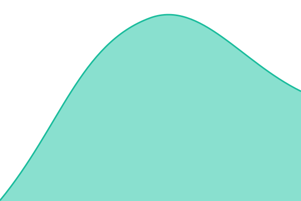

# [📈 Live Status](https://beloralabs-connect.github.io/connect-status): <!--live status--> **🟩 All systems operational**

This repository contains the open-source uptime monitor and status page for [BeLora Connect](www.belora-connect.com), powered by [Upptime](https://github.com/upptime/upptime).

With [Upptime](https://upptime.js.org), you can get your own unlimited and free uptime monitor and status page, powered entirely by a GitHub repository. We use [Issues](https://github.com/beloralabs-connect/connect-status/issues) as incident reports, [Actions](https://github.com/beloralabs-connect/connect-status/actions) as uptime monitors, and [Pages](https://beloralabs-connect.github.io/connect-status) for the status page.

<!--start: status pages-->
<!-- This summary is generated by Upptime (https://github.com/upptime/upptime) -->
<!-- Do not edit this manually, your changes will be overwritten -->
<!-- prettier-ignore -->
| URL | Status | History | Response Time | Uptime |
| --- | ------ | ------- | ------------- | ------ |
|  [Site web](https://www.belora-connect.com) | 🟩 Up | [site-web.yml](https://github.com/beloralabs-connect/connect-status/commits/HEAD/history/site-web.yml) | 

 273ms
     
 | 

<a href="https://beloralabs-connect.github.io/connect-status/history/site-web">100.00%</a>
    

|  [Administration](https://admin.belora-connect.com) | 🟩 Up | [admin.yml](https://github.com/beloralabs-connect/connect-status/commits/HEAD/history/admin.yml) | 

 295ms
     
 | 

<a href="https://beloralabs-connect.github.io/connect-status/history/admin">100.00%</a>
    

|  [API](https://api.belora-connect.com/health) | 🟩 Up | [api.yml](https://github.com/beloralabs-connect/connect-status/commits/HEAD/history/api.yml) | 

 256ms
     
 | 

<a href="https://beloralabs-connect.github.io/connect-status/history/api">100.00%</a>
    

|  [API (services internes)](https://api.belora-connect.com/ready) | 🟩 Up | [api-ready.yml](https://github.com/beloralabs-connect/connect-status/commits/HEAD/history/api-ready.yml) | 

 330ms
     
 | 

<a href="https://beloralabs-connect.github.io/connect-status/history/api-ready">100.00%</a>
    

|  [Cartesia](https://api.cartesia.ai/) | 🟩 Up | [cartesia.yml](https://github.com/beloralabs-connect/connect-status/commits/HEAD/history/cartesia.yml) | 

 319ms
     
 | 

<a href="https://beloralabs-connect.github.io/connect-status/history/cartesia">100.00%</a>
    

<!--end: status pages-->

[**Visit our status website →**](https://beloralabs-connect.github.io/connect-status)

## 📄 License

- Powered by: [Upptime](https://github.com/upptime/upptime)
- Code: [MIT](./LICENSE) © [Anand Chowdhary](https://anandchowdhary.com)
- Data in the `./history` directory: [Open Database License](https://opendatacommons.org/licenses/odbl/1-0/)
