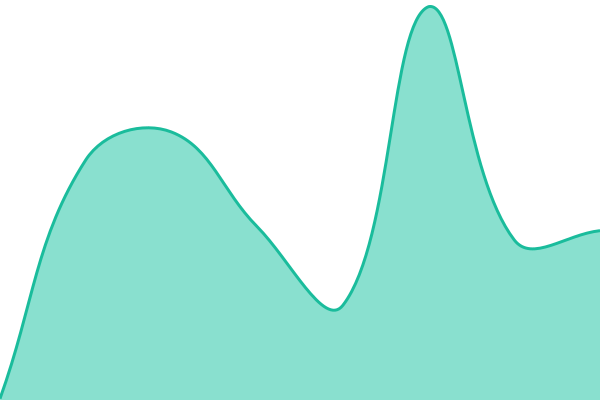
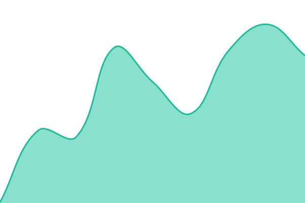

# [📈 Live Status](https://beloralabs-connect.github.io/connect-status): <!--live status--> **🟨 Degraded performance**

This repository contains the open-source uptime monitor and status page for [BeLora Connect](www.belora-connect.com), powered by [Upptime](https://github.com/upptime/upptime).

With [Upptime](https://upptime.js.org), you can get your own unlimited and free uptime monitor and status page, powered entirely by a GitHub repository. We use [Issues](https://github.com/beloralabs-connect/connect-status/issues) as incident reports, [Actions](https://github.com/beloralabs-connect/connect-status/actions) as uptime monitors, and [Pages](https://beloralabs-connect.github.io/connect-status) for the status page.

<!--start: status pages-->
<!-- This summary is generated by Upptime (https://github.com/upptime/upptime) -->
<!-- Do not edit this manually, your changes will be overwritten -->
<!-- prettier-ignore -->
| URL | Status | History | Response Time | Uptime |
| --- | ------ | ------- | ------------- | ------ |
|  [Connect API](https://api.belora-connect.com/health) | 🟨 Degraded | [connect-api.yml](https://github.com/beloralabs-connect/connect-status/commits/HEAD/history/connect-api.yml) | 

 171ms
     
 | 

<a href="https://status.belora-connect.com/history/connect-api">97.38%</a>
    

|  [Voice Translation](https://api.belora-connect.com/ready) | 🟩 Up | [voice-translation.yml](https://github.com/beloralabs-connect/connect-status/commits/HEAD/history/voice-translation.yml) | 

 182ms
     
 | 

<a href="https://status.belora-connect.com/history/voice-translation">100.00%</a>
    

<!--end: status pages-->

[**Visit our status website →**](https://beloralabs-connect.github.io/connect-status)

## 📄 License

- Powered by: [Upptime](https://github.com/upptime/upptime)
- Code: [MIT](./LICENSE) © [Anand Chowdhary](https://anandchowdhary.com)
- Data in the `./history` directory: [Open Database License](https://opendatacommons.org/licenses/odbl/1-0/)
